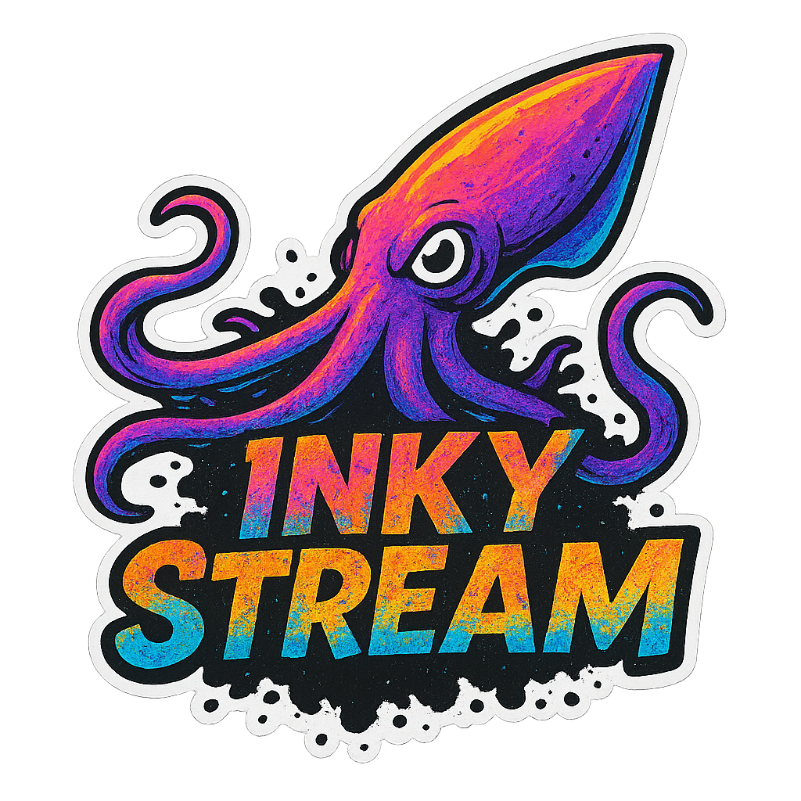

<p align="center">
  
</p>

<p align="center">
  A server for e-ink photo frames, built with AI tooling and designed for local network infrastructure.
</p>

---

**Heads up:** InkyStream was built using AI coding tools to solve a specific problem: getting photographs onto e-ink displays without fuss. It does exactly what it was designed to do, but hasn't been scrutinised or tested to any kind of production standard. Run it on a trusted local network, understand what you're deploying, and use it at your own risk.

## What it does

InkyStream runs on a home server and gives e-ink photo frames a brain. A frame wakes up on a schedule, calls the InkyStream API, downloads the next image, burns it to the screen, and goes back to sleep. Because e-ink holds its image without power, frames like the Pimoroni Inky Frame can run for months on batteries with no cables needed. Photos appear to change by themselves.

The challenge is making photographs look good on a screen that can only display six or seven colours. InkyStream handles this automatically using dithering, an algorithm that uses patterns of dots to simulate tones and gradients the hardware can't natively show. Upload a photo, InkyStream processes it, and a correctly sized and dithered variant for each configured device is ready to serve.

<p align="center">
  <br>
  <em>A Pimoroni Inky Frame 7.3" displaying a dithered photograph, running on batteries with no cables.</em>
</p>

**Features:**

- Web UI to upload photos, organise them into categories, and browse processed images
- Automatic dithering and resizing on upload, optimised per device display profile
- HTTP API for frames to request their next image (`random`, `next`, or `current`)
- Supports multiple devices with different display sizes and colour palettes
- Generates working MicroPython, Arduino, and Raspberry Pi code for each device
- Optional API key for basic protection on image-serving endpoints

**A note on image quality:** dithering works best with images that have strong contrast. Landscapes, black and white photography, and bold compositions tend to translate well. From across a room the results can be genuinely striking. Up close the dot pattern is visible. Set expectations accordingly.

## Hardware

InkyStream is built around the [Pimoroni Inky Frame](https://shop.pimoroni.com/products/inky-frame-7-3) family. These are e-ink displays with six colours and a Raspberry Pi Pico W built in, running MicroPython. The 7.3" Spectra 6 display profile is included out of the box. Other display sizes and colour palettes can be added to `config/displays.json`.

The code generator in the device setup UI produces working MicroPython for Inky Frame, Python for Raspberry Pi, and Arduino/ESP32 sketches, or you can write your own using the template variable system.

## Using InkyStream

Once the server is running, open `http://your-server-ip:3000` in a browser. The workflow is straightforward:

**1. Add a device**

Go to the Devices tab and create a new device. Give it a name, select the display profile that matches the hardware, and choose a platform (MicroPython, Raspberry Pi, Arduino, or custom). InkyStream will generate ready-to-use code for that device which you can copy directly from the device page.

**2. Upload photos**

Go to the Upload tab. Drag and drop photos or browse to select them. Assign each upload to a category, choose a dithering algorithm (Floyd-Steinberg works well for most images), and select which devices to process for. InkyStream handles the rest — resizing, dithering, and saving a processed variant for each device.

<p align="center">
  <br>
  <em>The upload screen. Photos are processed and dithered automatically on upload.</em>
</p>

**3. Browse the gallery**

The gallery shows all processed images organised by category. Each image displays a thumbnail of the dithered result. Images can be deleted or reprocessed for different devices from here.

<p align="center">
  <br>
  <em>The image gallery, showing processed variants organised by category.</em>
</p>

**4. Flash the code to the frame**

On the device page, copy the generated code for the platform. For Inky Frame, paste it into Thonny, update the WiFi credentials and server address, save it as `main.py`, and upload it to the device. The frame will connect, call the API, and display its first image.

## Running with Docker

A pre-built image is published to [GitHub Container Registry](https://github.com/8ix/inkystream/pkgs/container/inkystream) and supports `amd64` and `arm64` — standard servers and Raspberry Pi 4/5 are both covered.

**Docker Compose (recommended):**

Create a `docker-compose.yml` file:

```yaml
services:
  inkystream:
    image: ghcr.io/8ix/inkystream:latest
    container_name: inkystream
    restart: unless-stopped
    ports:
      - "3000:3000"
    environment:
      - INKYSTREAM_API_KEY=your_secret_key
      - NODE_ENV=production
    volumes:
      - ./images:/app/images
      - ./config:/app/config
```

Then start it:

```bash
docker compose up -d
```

**Plain Docker:**

```bash
docker run -d \
  -p 3000:3000 \
  -e INKYSTREAM_API_KEY=your_secret_key \
  -v $(pwd)/images:/app/images \
  -v $(pwd)/config:/app/config \
  --name inkystream \
  ghcr.io/8ix/inkystream:latest
```

Open `http://your-server-ip:3000` in a browser.

## Running natively

InkyStream is a standard Next.js application. Clone the repo and follow the [Next.js deployment documentation](https://nextjs.org/docs/app/building-your-application/deploying) to run it without Docker.

## Pointing a frame at it

Call one of these endpoints from a frame to get an image URL:

```
GET /api/devices/{deviceId}/random?key=YOUR_KEY
GET /api/devices/{deviceId}/next?key=YOUR_KEY
GET /api/devices/{deviceId}/current?key=YOUR_KEY
```

Response:

```json
{ "success": true, "data": { "imageUrl": "/api/img/..." } }
```

Prepend the server address to `imageUrl` and fetch the image.

## Environment variables

| Variable | Default | Description |
|---|---|---|
| `INKYSTREAM_API_KEY` | *(unset)* | Required on all endpoints when set. Leave unset for open local access. |
| `PORT` | `3000` | Port the server listens on. |

## License

MIT. See [LICENSE](LICENSE).
